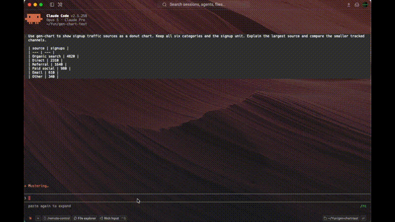

[English](../README.md) · 简体中文

# gen-chart

**把数据、描述或粘贴的表格直接转换为精美的交互式图表。**

gen-chart 是一个 Agent Skill，也是一套零运行时依赖的 Node.js 渲染与验证系统，适用于 Claude Code、Cursor、Codex CLI 和 OpenCode。智能体负责编写带类型的 JSON 规范；gen-chart 以确定性的方式将其编译为单个自包含 HTML 文件，并拒绝生成数据无法支撑的图表。

- **四类图表**——使用一份带类型的规范生成趋势、比较、分布、占比和热力图
- **从结构上保证诚实**——验证器会拒绝截断柱状图坐标轴、混合单位、难以阅读的饼图和误导性的归一化，并提供机器可读的修复回执
- **一个文件即可分享**——内联 SVG、嵌入数据、无 CDN、可离线运行；支持导出 PNG、SVG、底层 CSV 和 1200×630 分享卡片
- **无需鼠标也能阅读**——每张图表都包含供屏幕阅读器使用的数据表和完整的键盘导航；两种主题的配色均通过 WCAG AA 验证


**[项目主页](https://gen-chart.github.io/gen-chart/)** · **[中文路线图](ROADMAP.zh-CN.md)** · **[English roadmap](../ROADMAP.md)** · **[设计系统](../DESIGN.md)** · **[Skill 契约](../gen-chart/SKILL.md)**

项目主页也是最快的入门方式：选择 Cursor、Codex、Claude Code 或 OpenCode，复制对应的安装命令，然后通过任一已验证示例了解完整的**提示词 → 带类型的 JSON IR → 交互式图表**流程。每个示例都会公开展示级验证回执以及源文件和制品的精确摘要。

---

```bash
npx skills add gen-chart/gen-chart -g
```

使用 Cursor？请打开[智能体专属快速入门](https://gen-chart.github.io/gen-chart/?agent=cursor#install)，查看准确的全局和项目安装命令。

**无需仓库：**只需在任意智能体对话中描述图表并附上数据。

[](https://gen-chart.github.io/gen-chart/)

## 快速开始

### 01 · 安装 Skill

**工具保留在本地。** 一条命令即可把同一套经过检查的 Skill 和零依赖渲染器安装到你使用的智能体中，无需为不同供应商维护分支。

```bash
npx skills add gen-chart/gen-chart -g
```

`-g` 表示安装到用户目录；去掉它则安装到当前项目。私有仓库同样可用，并会沿用现有的 Git 凭据。

显式的非交互式命令：

```bash
npx -y skills add gen-chart/gen-chart --skill gen-chart --agent claude-code --global --copy --yes
```

也可以手动安装。先构建确定性的压缩包：

```bash
cd gen-chart && npm run build:zip
```

将 `gen-chart.zip` 解压到智能体的 Skill 目录。例如 Claude Code 使用 `~/.claude/skills/`，最终目录为 `<skills>/gen-chart`。需要 Node.js ≥ 22。Skill 会在会话启动时加载，因此安装后请新建会话。

### 02 · 输入一条消息，获得一张图表

**一条提示词应包含图表所需的一切。** 无需仓库、API 密钥或运行中的服务，但数据必须出现在消息中，或位于你明确指出的文件里。gen-chart 不会虚构数字；缺少数据时，它会请求数据而不是生成图表。

一条好的提示词包含四项内容：

- **数值**——直接粘贴，或提供工作区文件路径
- **一个最重要的比较关系**
- **单位**
- **希望读者得出的结论**

下面的每条提示词都可以直接复制使用。

#### 从描述开始——无需文件

```text
Use gen-chart to plot monthly active users for the last six months:
10500, 12300, 13800, 14600, 15900, 17400 starting in January 2026.
Mark the v2 launch in February.
```

```text
Use gen-chart to compare Q1 and Q2 revenue by region:
North America 1650/1840, Europe 1380/1420, Asia-Pacific 820/990,
Latin America 380/410, Middle East & Africa 250/260 (USD thousands).
```

#### 从工作区文件开始

```text
Inspect data/revenue.csv (your file), then use gen-chart to chart quarterly revenue by region.
Show one clear message in the title, at most two emphasized series,
and put the supporting detail in cards instead of on the canvas.
```

这条流程会先运行 `inspect-data`，使智能体根据带类型的列概况编写规范，而不是凭记忆重新抄写数字。只要数据超过几行，就值得使用这种方式。

#### 各图表类别示例

```text
Use gen-chart to show the distribution of these API response times and describe the tail:
42 48 55 59 62 65 68 71 74 78 82 86 92 98 104 112 125 148 195 240
```

```text
Use gen-chart to compare build durations across our pipelines as a boxplot (seconds):
unit:         42 45 47 48 50 51 53 55 58 71
integration: 118 124 131 136 140 145 152 158 166 210
e2e:         295 312 328 341 355 370 388 402 425 610
```

```text
Use gen-chart to build a heatmap of support tickets by day and shift.
Columns are Mon through Sun.
Morning:    48 41 39 37 44 12 9
Afternoon:  62 55 51 49 58 18 14
Night:      21 17 15 16 24 8 6
```

```text
Use gen-chart to show signup traffic by source as a donut: organic 4820, direct 2310,
referral 1640, paid social 980, email 610, other 340.
```

```text
Use gen-chart to create a bubble chart of venue performance.
Advertising spend (GBP k): 18 24 31 39 47 56 68 75
Event profit (GBP k):       9 14 13 22 28 31 38 44
Venue capacity (seats):   350 520 420 850 1100 950 1600 2100
Put spend on x, profit on y, and encode capacity as bubble area.
```

#### 引导视图、本地化和迭代

```text
Use gen-chart to chart 12 months of monthly active users from September 2025,
and add guided views for the full year, the period after the v2 launch in
February 2026, and paying users on their own.
All active: 8200 8900 9400 9100 10500 12300 13800 14600 15900 17400 18100 19700
Paying:      610  700  780  760   940  1180  1420  1560  1810  2050  2230  2540
```

```text
用 gen-chart 画一张各渠道季度营收的柱状图，界面语言用中文。单位万元：
直销：1240 1380 1510 1720
渠道伙伴：860 910 1040 1180
（第一季度至第四季度）
```

随后可在对话中继续修改。带类型的规范会保留下来，因此后续请求会编辑现有规范，而不是从头开始：

```text
add a target line at 15000 and mark the months below it
```

#### 它会拒绝哪些请求

可以有意尝试下面的提示词：

```text
Use gen-chart to make a pie chart of our spend by category (USD k):
Salaries 4200, Cloud 1850, Contractors 940, Marketing 780, Travel 410,
Software 360, Office 290, Legal 220, Recruiting 180, Training 120,
Events 95, Other 70.
```

验证器将饼图限制为最多 7 个扇区。因此，它不会悄悄生成难以阅读的图表，而是建议改用排序柱状图，或保留前 6 项并把其余项目明确合并为“其他”，同时解释原因。要求截断柱状图坐标轴或在同一坐标轴混用两个单位时，也会采用相同的处理方式。

## 选择合适的图表

| 类别             | 标记                                                       | 最适合                             | 提示词中应包含                |
| ---------------- | ---------------------------------------------------------- | ---------------------------------- | ----------------------------- |
| **Cartesian**    | 折线、柱形、分组、堆叠、百分比堆叠、面积、区间、散点、气泡 | 趋势、比较、构成、不确定性、相关性 | x、y 或边界、系列、单位和大小 |
| **Distribution** | 直方图、箱线图                                             | 分布、离群值、形态                 | 原始观测值，而不是摘要        |
| **Proportion**   | 饼图、环形图                                               | 整体中的占比（最多 7 项）          | 类别及其数值                  |
| **Matrix**       | 热力图                                                     | 两类维度 × 强度                    | 行、列和数值                  |

不确定时可询问路由器；如果图表类型不合适，它也会提出理由：

```bash
node bin/gen-chart.mjs guide "composition of accounts by plan tier over time" --json
```

支持线性、时间、分类型和对数比例尺。时间比例尺接受 UTC ISO 时间戳，也接受年、月、日历日期。分布图接收**原始观测值**：渲染器自行计算分箱、四分位数和 Tukey 围栏，并在图表中说明计算结果。

笛卡尔图表可以叠加用户编写的运维事件。重要部署或告警可使用带标签的 `x-line` 注释；紧凑的顶部事件带可使用 `event-strip` 注释。两者在框选缩放和规范导出中都会保持对齐；事件带还支持可选的语义颜色角色和无障碍标签。

本地执行 `npm test` 不会启动已安装的桌面浏览器。设置 `GEN_CHART_BROWSER_TESTS=1` 可启用真实 Chrome 冒烟测试和 PNG 测试；CI 在 Chrome 可用时会自动运行它们。显式的无头浏览器启动会关闭首次运行、默认浏览器检查和错误对话框界面。

## 诚实性规则

每条规则都会返回稳定的代码、准确的规范路径、测量证据和可接受的修复方案：

- **柱状图和面积图保持零基线**——它们通过长度编码，截断坐标轴会造成误导
- **每条坐标轴只能使用一个单位**——不会静默混用
- **饼图扇区**必须非负、数量为 2–7 个，并与声明的总计一致
- **直方图分箱**应接近 Freedman–Diaconis 规则的建议值，并在图表中披露
- **对数轴**拒绝柱形标记、非正数和 `zero: true`，并明确标注自身
- **堆叠图**拒绝负数、混合标记和单一系列
- **百分比堆叠图**会披露变化的分母，并在工具提示中保留绝对值
- **方向性色彩**（`positive`/`negative`）不得用于正负混合的数据
- **区间带**需要成对且有序的边界，并明确说明含义，例如“95% 置信区间”
- **散点和气泡密度**在可见点超过 2,000 个时发出警告，因为重叠标记可能掩盖分布
- **热力图**的顺序色阶拒绝负数；发散色阶必须声明中点
- **相邻堆叠区段**必须在感知上可区分，并通过 CIEDE2000 验证

此外还会检查刻度碰撞、注释重叠、点密度、堆叠深度，以及过密或过疏的网格。

## 工作原理

| 步骤                  | 发生的操作                                                              |
| --------------------- | ----------------------------------------------------------------------- |
| **Route**             | `guide` 根据问题选择图表类别，或说明更合适的选择                        |
| **Profile**           | `inspect-data` 返回带类型的列概况，避免从记忆中重新抄写数字             |
| **Author**            | 智能体编写带类型的 JSON 规范，并逐字嵌入数据                            |
| **Validate**          | 执行 Schema、数据完整性、语义、诚实性和构图检查；失败时返回修复回执     |
| **Deliver**           | 渲染、检查并原子提交 HTML 或 SVG；HTML 可选配 PNG 预览，均提供 SHA-256 回执 |
| **Verify on request** | `visual-check` 在四种桌面尺寸下测量内容边界，并捕获浅色和深色截图       |

默认快速流程可直接运行 `deliver`。它会在原子写入 HTML 前进行展示级验证。只有需要在不写入制品的情况下查看诊断信息时，才单独使用 `validate`。

```bash
node bin/gen-chart.mjs deliver cartesian spec.json chart.html --quality showcase --json
```

```bash
node bin/gen-chart.mjs validate cartesian spec.json --quality showcase --json
```

```bash
node bin/gen-chart.mjs inspect-data data.csv --spec-out draft.json --json
```

默认交付 HTML 或独立 SVG，无需浏览器。将目标文件扩展名改为 `.svg`，即可输出包含标题、副标题、样式、图例和计算说明的矢量图。
CLI 仅在提供 `--preview png` 时生成 PNG。若宿主可内联显示本地 Markdown 图片（包括 Codex 桌面端），随附的技能会自动添加该选项，除非用户明确要求不生成 PNG。也可以在 HTML 交付完成后单独生成预览，预览失败不会影响已交付的 HTML：

```bash
node bin/gen-chart.mjs deliver cartesian spec.json chart.svg --quality showcase --json
node bin/gen-chart.mjs preview chart.html chart.png --json
node bin/gen-chart.mjs batch jobs.json --quality showcase --json
```

批量命令在同一个 Node 进程内生成多个独立制品，并可共享一份数据。
清单格式与 JavaScript API 见 [API 与批量渲染指南](../gen-chart/references/rendering-api.md)；
优化依据见[渲染性能改进计划](rendering-performance.md)。其他命令包括 `render`、`visual-check`、`guide`、`demo` 和 `doctor`。

## 交付图表中的操作

| 操作               | 方法                                                                            |
| ------------------ | ------------------------------------------------------------------------------- |
| 读取精确数值       | 悬停；或聚焦图表后使用 <kbd>←</kbd> <kbd>→</kbd> <kbd>Home</kbd> <kbd>End</kbd> |
| 显示或隐藏系列     | 单击图例；双击可隔离一个系列                                                    |
| 查看系列统计       | 单击系列，查看最小值、最大值、平均值、末值和数量                                |
| 缩放时间窗口       | 在图表中拖动（需要启用）；按 <kbd>Esc</kbd> 重置                                |
| 重放用户编写的解读 | 使用引导视图栏                                                                  |
| 切换主题           | 使用 Theme，或跟随 `prefers-color-scheme`                                       |
| 导出               | 图片：PNG 或独立 SVG；分享与数据：分享卡片或底层 CSV                            |

深层链接可恢复状态：`#theme=`、`#palette=`、`#focus=`、`#hidden=`、`#brush=`、`#view=`。HTML 工具栏包含 Classic、Cool、Warm 和 Primary 配色选择器。显式选择配色后，所有显示中的系列都会按顺序重新着色，包括带角色的系列和热力图色块。最多三种颜色的图表使用三色色组；更大的图表和热力图使用全部六种颜色。图片与分享卡片导出会包含图例，并以静止状态下的规范图表捕获当前主题和配色，不会包含悬停、淡化或缩放状态。

**无障碍。** 每张图表都包含视觉隐藏的精确数据表；所有类别均支持键盘逐项浏览和实时区域播报；状态提示不只依赖颜色；语义角色和热力图颜色在两种主题下均通过 WCAG AA 检查。可选择分类配色的进一步强化工作记录在路线图中。屏幕宽度低于 700px 时，图表会保持清晰可读的最小宽度，并在自身面板内滚动，而不是缩小字体。

## 为什么选择 gen-chart

- **带类型的 JSON IR**——智能体负责声明，而不是绘图；几何、比例尺和刻度由确定性的渲染器处理
- **失败会附带修复回执**——提供稳定代码、准确对象路径、测量证据和有效修复方法，而不是堆栈跟踪
- **保留数据来源**——CSV 导出内容与嵌入数据完全一致，读者可以从制品重建图表
- **手写 SVG，零运行时依赖**——拥有几何计算才能实现字节稳定的黄金输出，以及真正理解图表的验证
- **以验证代替断言**——测试覆盖真实浏览器、WCAG AA 对比度计算和依据公开测试向量验证的 CIEDE2000；CI 在 Node 22 和 24 上运行，并证明软件包可按字节确定性构建且能独立运行

## 安装位置

`npx skills add` 会自动放置文件，并支持包括 Claude Code、Cursor、Codex 和 OpenCode 在内的多种智能体。使用 `--agent` 可指定目标：

```bash
npx skills add gen-chart/gen-chart -g --agent cursor
```

手动安装时，Claude Code 从 `~/.claude/skills/` 读取用户级 Skill，或从 `.claude/skills/` 读取项目级 Skill。其他智能体的位置不同；可查看相应文档，或交由 CLI 处理。

## 开发

贡献指南、本地设置、仓库结构、测试和发布工具请参阅 **[DEVELOPMENT.md](../DEVELOPMENT.md)**。

## 许可证

[MIT](../LICENSE)
